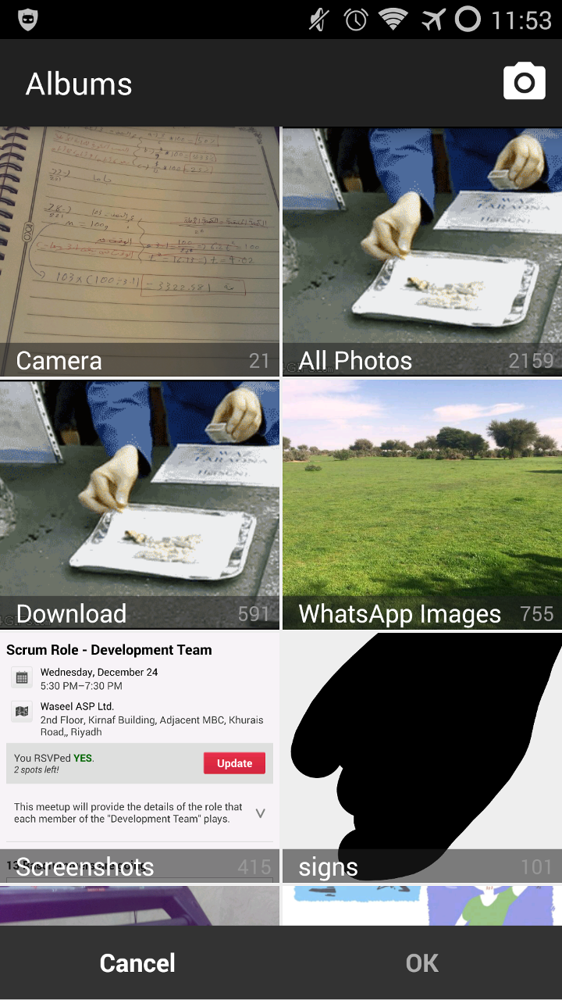
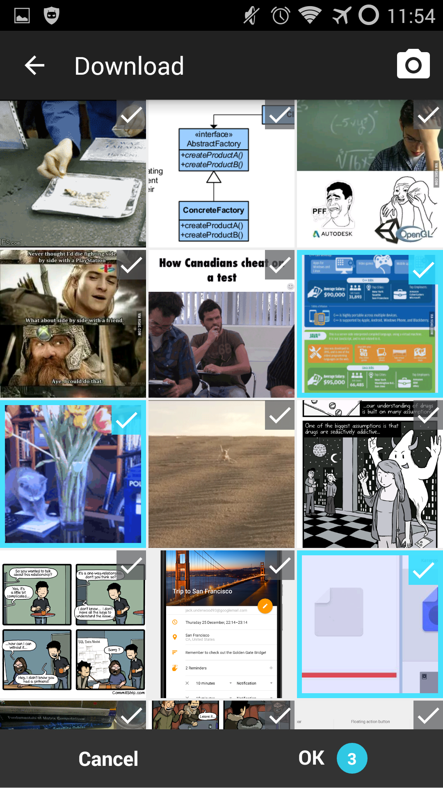

#Notice
-Picker.Builder(Context,Listener) has been replaced with (Context,Listener,themeResId) and it's highely recommended to use the new constructor

-``` onPickedSuccessfully(String[] paths)``` has been replaced with ``` onPickedSuccessfully(ArrayList<ImageEntry> images)```

-The sample in google play and screenshots are out-of-date , will update them on 1.2 or 1.3 version

MultiImagePicker
================

A library to pick multi images With features like setting limit and UI that goes nicely with your app theme

Sample App (On playstore) : https://play.google.com/store/apps/details?id=net.yazeed44.imagepicker.sample

This library is built-in gallery to pick multiple images or capture new photos , and retrieve the path in the code


This library is inspired by Telegram image picker


  


:app  is the sample application 


:imagepicker  is the library source code

Gradle Dependency (jCenter)
==========================
Just add the dependency to your build.gradle file
```gradle 
compile 'net.yazeed44.imagepicker:imagepicker:1.3.1'
```

[  ](https://bintray.com/yazeed44/maven/multi-image-picker/_latestVersion)

Also don't forget to add [cwac-cam2](https://github.com/commonsguy/cwac-cam2) repository by declaring this in your ```build.gradle```

```gradle
repositories {
    maven {
        url "https://repo.commonsware.com.s3.amazonaws.com"
    }
}

```


### If jCenter is Having Issues (the library can't be resolved)

Add this to your app's build.gradle file:

```Gradle
repositories {
    maven { url 'https://dl.bintray.com/yazeed44/maven' }
}
```


Getting started
==========

It's easy

-Define a style that uses a toolbar instead of actionbar , if you have already has a style who does that skip this step
```xml
<style name="MIP_theme" parent="AppTheme">

    <item name="windowActionBar">false</item>
    <item name="windowNoTitle">true</item>

</style>
```

```java
private void pickImages(){
       
    //You can change many settings in builder like limit , Pick mode and colors
    new Picker.Builder(this,new MyPickListener(),R.style.MIP_theme)
        .build()
        .startActivity();

}
    
private class MyPickListener implements Picker.PickListener {

    @Override
    public void onPickedSuccessfully(final ArrayList<ImageEntry> images) {
        doSomethingWithImages(images);
    }

    @Override
    public void onCancel() {
        //User canceled the pick activity
    }
}
```

## Make Photo/Video capture optional

In order to capture photos and videos the library depends on [cwac-cam2](https://github.com/commonsguy/cwac-cam2) library.
If you just want to pick images from gallery you can disable the capture feature by excluding the `cwac-cam2` library from your module:

```gradle
compile('net.yazeed44.imagepicker:imagepicker:1.3.1') {
    exclude module: 'cam2'
}
// or
configurations.compile.exclude module: 'cam2'
```

##Contribution

### Questions

If you have any questions regarding MultiImagePicker,create an Issue

### Feature request

To create a new Feature request, open an issue 

I'll try to answer as soon as I find the time.

### Pull requests welcome

Feel free to contribute to MultiImagePicker.

Either you found a bug or have created a new and awesome feature, just create a pull request.


### Discuss
Join in the conversation , [Join us in telegram](https://telegram.me/joinchat/013dbd2b01ae8b2dcdb1147ac067c9ae).


